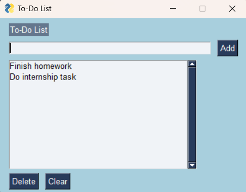
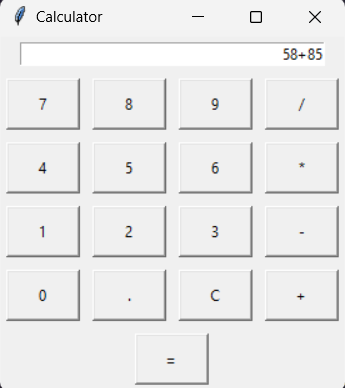
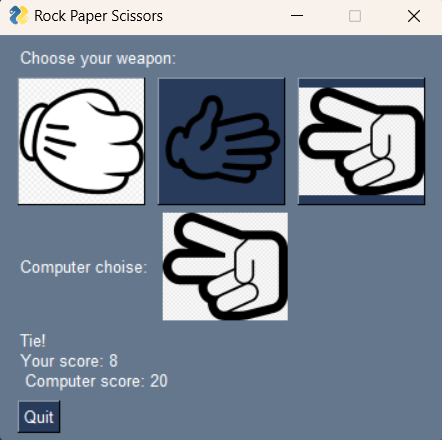
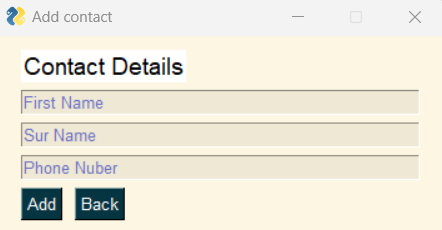
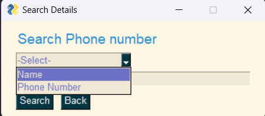
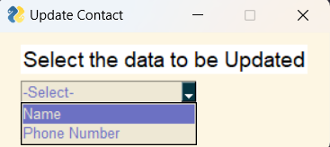
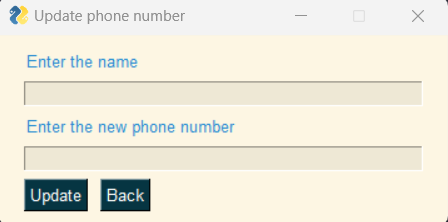
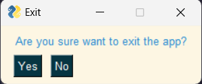
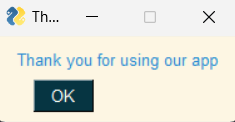

# CODESOFT

# To- Do ListPySimpleGUI To-Do List
A simple to-do list application built using PySimpleGUI in Python. This application allows users to manage their tasks with basic functionalities such as adding tasks, deleting the last task, clearing the entire task list, and handling the Enter key for a seamless user experience.

Features
Add Task: Enter your task in the input field and click the 'Add' button, or press Enter for quick task addition.

Delete Task: Remove the last added task with the 'Delete' button.

Clear All Tasks: Clear the entire task list with the 'Clear' button.

How to Use
Clone the repository to your local machine.
Install the required dependencies: pip install PySimpleGUI.
Run the todolist.py script to launch the to-do list application.

# Calculator
This is a simple calculator application built using Python and the Tkinter library. The calculator provides a graphical user interface for performing basic arithmetic operations.

Features
User-Friendly Interface:

The calculator features a clean and user-friendly interface, making it easy for users to input and evaluate mathematical expressions.
Responsive Design:

The layout is designed to be responsive, ensuring a seamless user experience on various screen sizes.
Basic Arithmetic Operations:

Supports addition, subtraction, multiplication, and division.
Clear Functionality:

The "C" button allows users to clear the display, enabling them to start fresh with a new calculation.
Error Handling:

If an invalid expression is entered, the calculator displays an "Error" message.
Keyboard Support:

Users can also use their keyboard to input numbers and perform calculations, enhancing accessibility.

Dependencies
Tkinter:
The Tkinter library is used for creating the graphical user interface.

# Password Generator App
A simple Password Generator application built with PySimpleGUI in Python. This application allows users to generate random passwords with specified lengths.

Features
Password Length Control: Set the desired length for your password.

Generate Password: Click the 'Generate Password' button or press Enter to generate a random password.

How to Use
Clone the repository to your local machine.
Install the required dependencies: pip install PySimpleGUI.
Run the password_generator.py script to launch the Password Generator application.
Enter the desired password length.
Click the 'Generate Password' button or press Enter to generate a new password.
The generated password will be displayed in the 'Your Password' field.

# Rock Paper Scissors Game
A simple Rock Paper Scissors game implemented in Python using PySimpleGUI. Play against the computer and see who comes out on top!

Features
Visual Representation: Choose your weapon by clicking on the Rock, Paper, or Scissors buttons with visual representations.

Computer Opponent: Play against a computer opponent that randomly selects Rock, Paper, or Scissors.

Score Tracking: Keep track of your score against the computer.

How to Play
Clone the repository to your local machine.
Install the required dependencies: pip install PySimpleGUI.
Run the rock_paper_scissors.py script to launch the Rock Paper Scissors game.
Click on the buttons to choose your weapon.
The computer will make its choice, and the result will be displayed along with the updated scores.
Keep playing and see who dominates the game!

# Contact Management System
This is a simple Contact Management System implemented in Python using PySimpleGUI and MySQL Connector. The application allows users to perform various operations related to contacts, such as adding, viewing, searching, updating, and deleting contacts.

Requirements
Python 3.x
PySimpleGUI
pandas
matplotlib
mysql-connector-python

Installation
Install the required Python packages:
   
      pip install PySimpleGUI pandas matplotlib mysql-connector-python
Ensure that you have a MySQL server installed and running.

Set up a MySQL database named contactmingle and create a table named contactInfo with columns id, first_name, sur_name, and phone_number.

Database Code
  CREATE DATABASE contactmingle

  CREATE TABLE contactInfo
  (id INT PRIMARY KEY AUTO_INCREMENT,
   first_name VARCHAR(50),
   sur_name  VARCHAR(50),
   rphone_number VARCHAR(50))

Usage
Run the script template.py to import necessary functions.

Run the main script contactpage.py to launch the Contact Management System.

The system provides a user-friendly interface with options to add, view, search, update, and delete contacts.

Follow the on-screen instructions to perform the desired operations.

Features
Add Contact: Add a new contact with a first name, surname, and phone number.

View Contacts: View all contacts in a tabular format. You can close the table by clicking the "Back" button.

Search Contacts: Search for contacts based on either name or phone number.

Update Contacts: Update the first name or phone number of a contact.

Delete Contacts: Delete a contact based on the first name.

Exit: Safely exit the application.

